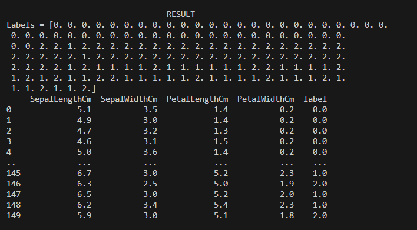

# Unsupervised-Learning-Ca-GaIB
Implementation of DBScan, Kmeans, and Kmedoids algorithm with python.

## Table of Contents
* [General Info](#general-information)
* [Technologies Used](#technologies-used)
* [How to run](#how-to-run)
* [Screenshots](#screenshots)


## General Information
Implementation of DBScan, KMeans, and KMedoids with python to the [Iris](https://www.kaggle.com/datasets/uciml/iris) Dataset (Only supporting iris dataset because the preprocessing step depends on each dataset).


## Technologies Used
- python - version 3.10
- pandas - version 1.4.3
- numpy - version 1.21.6

## How to run
1. Use this command in the root directory of the repository
```
python main.py
```
2. Choose the algorithm for clustering
3. Set the hyperparameters
4. The labels of data will be printed to the screen

## Screenshots
Result screenshot:

